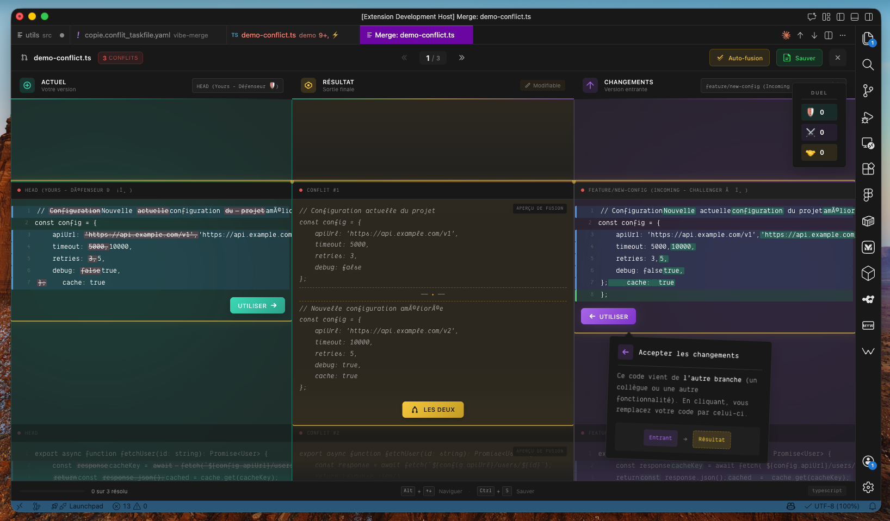
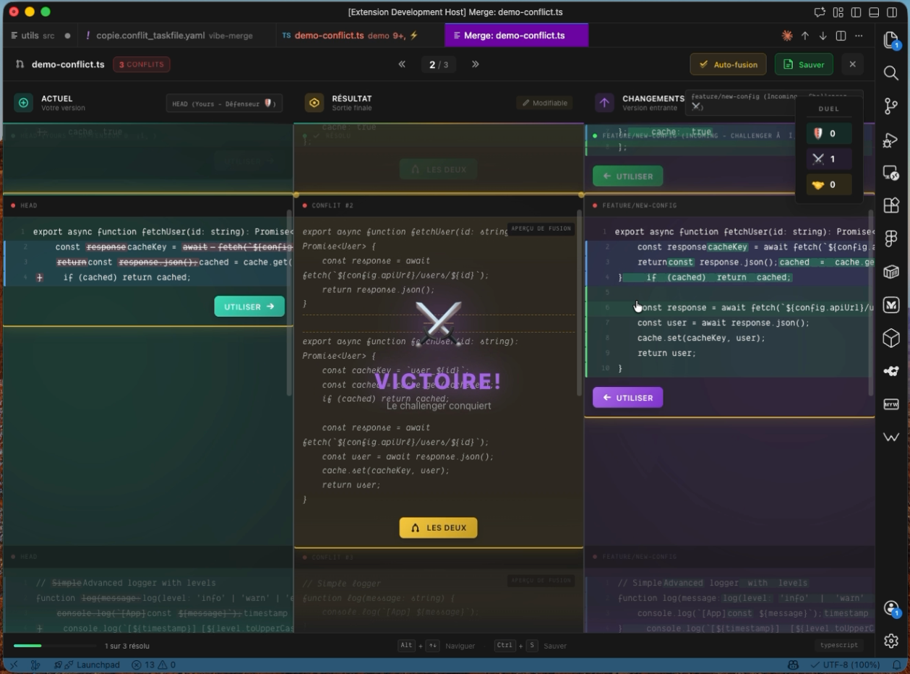
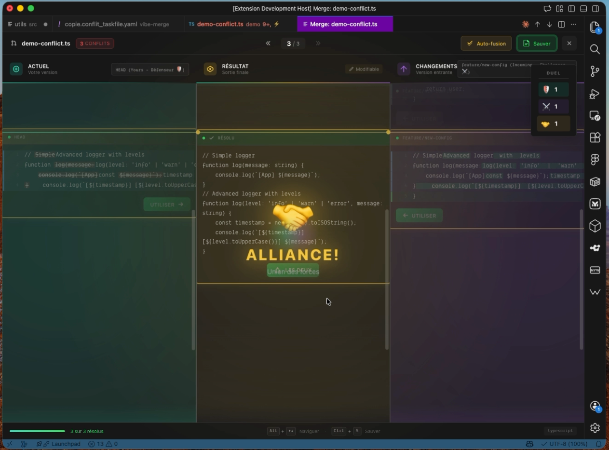
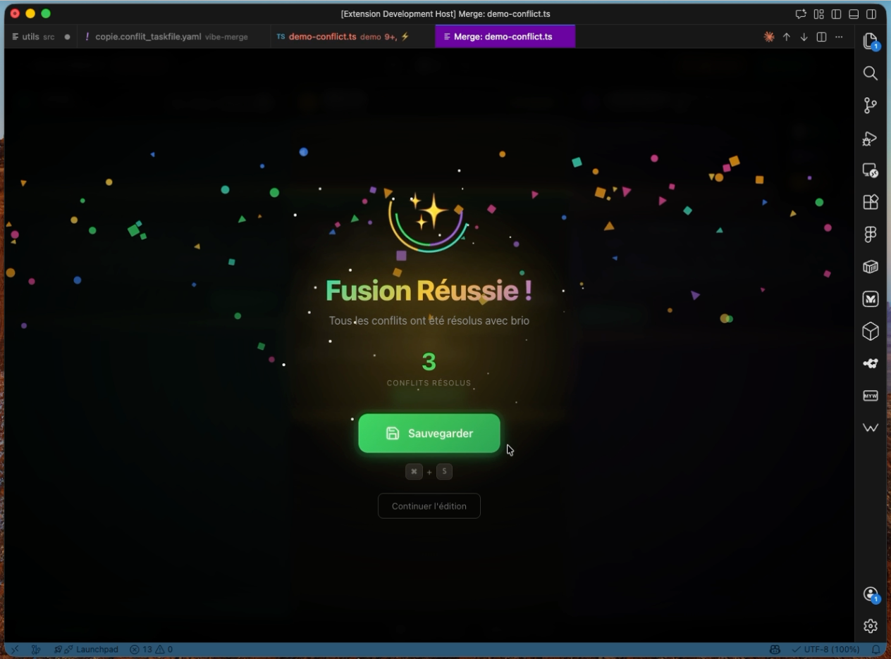

# VibeMerge 🎮⚔️

> Un éditeur de merge 3-way **épique** pour VS Code, inspiré d'IntelliJ IDEA — avec système de duel et célébration de victoire !


---

## 📸 Aperçu

### 🎬 Démo en action


### Éditeur 3-Way

*Vue triple panneau : Current (🛡️) | Result (📝) | Incoming (⚔️)*

### Système de Duel
| Défense 🛡️ | Victoire ⚔️ | Alliance 🤝 |
|------------|-------------|-------------|
|  |  |  |

### Célébration de Victoire

*Tous les conflits résolus = Confettis et célébration !*

---

## ✨ Fonctionnalités

### 🎯 Éditeur 3-Way Premium
- **Vue triple panneau** : Current (Gauche) | Result (Centre) | Incoming (Droite)
- **Scroll synchronisé** entre les trois panneaux
- **Coloration syntaxique** automatique selon le langage
- **Numéros de ligne** pour une navigation précise
- **Support diff3** avec contenu de base pour une meilleure analyse

### 🎮 Système de Duel Épique
Chaque résolution de conflit devient un **duel épique** !

| Action | Résultat | Animation |
|--------|----------|-----------|
| Accept Left | 🛡️ **DÉFENSE!** | Bouclier cyan lumineux |
| Accept Right | ⚔️ **VICTOIRE!** | Slash diagonal violet |
| Accept Both | 🤝 **ALLIANCE!** | Fusion dorée |

### 📊 Score Board en Temps Réel
- Compteur de **Défenses** 🛡️
- Compteur de **Victoires** ⚔️
- Compteur d'**Alliances** 🤝
- Animation pulse à chaque point marqué

### 🎉 Célébration de Victoire
Quand tous les conflits sont résolus :
- Overlay de célébration avec confettis
- Animation spectaculaire
- Bouton de sauvegarde rapide
- Raccourci clavier affiché

### 🔧 Gestion Intelligente de l'Encodage
- **Détection automatique** UTF-8, Latin-1, etc.
- **Correction mojibake** automatique (caractères corrompus)
- **Préservation** des fins de ligne (LF/CRLF)
- **Status bar** avec indicateur de confiance

---

## 📦 Installation

### Option 1 : Depuis le fichier .vsix (recommandé)

1. Télécharge le fichier `vibe-merge-x.x.x.vsix` depuis les [Releases](../../releases)
2. Dans VS Code, ouvre la palette de commandes (`Cmd+Shift+P` / `Ctrl+Shift+P`)
3. Tape **"Extensions: Install from VSIX..."**
4. Sélectionne le fichier `.vsix` téléchargé
5. Redémarre VS Code

### Option 2 : Build depuis les sources

```bash
# Clone le repo
git clone https://github.com/your-username/vibe-merge.git
cd vibe-merge

# Installe les dépendances
bun install

# Compile
bun run compile

# Crée le package
bunx @vscode/vsce package --allow-missing-repository

# Installe le .vsix généré via VS Code (voir Option 1)
```

---

## 🎹 Raccourcis Clavier

| Raccourci | Action |
|-----------|--------|
| `Cmd+Alt+M` (Mac) / `Ctrl+Alt+M` (Win/Linux) | Ouvrir l'éditeur de merge |
| `Cmd+Shift+←` / `Ctrl+Shift+←` | Accepter gauche (Défense 🛡️) |
| `Cmd+Shift+→` / `Ctrl+Shift+→` | Accepter droite (Victoire ⚔️) |
| `Alt+↑` / `Alt+↓` | Naviguer entre les conflits |
| `Cmd+S` / `Ctrl+S` | Sauvegarder |

---

## 🎮 Utilisation

### Commandes disponibles

Ouvre la palette de commandes (`Cmd+Shift+P`) et tape "VibeMerge" :

| Commande | Description |
|----------|-------------|
| **Open Merge Editor** | Ouvre l'éditeur de merge pour le fichier actuel |
| **Resolve All Conflicts** | Auto-résout les conflits simples |
| **Accept Current (Left)** | Accepte la version actuelle (Défense) |
| **Accept Incoming (Right)** | Accepte la version entrante (Victoire) |
| **Accept Both Changes** | Garde les deux versions (Alliance) |

### Workflow typique

```
1. 🔀 Tu as un conflit git après un merge/rebase
2. 📂 Ouvre le fichier en conflit
3. ⌨️  Utilise Cmd+Alt+M pour ouvrir VibeMerge
4. 👀 Tu verras 3 panneaux :
   ┌─────────────┬─────────────┬─────────────┐
   │   CURRENT   │   RESULT    │  INCOMING   │
   │   (Yours)   │  (Preview)  │  (Theirs)   │
   │     🛡️      │     📝      │     ⚔️      │
   └─────────────┴─────────────┴─────────────┘
5. 🎮 Résous chaque conflit - Profite des animations de duel !
6. 🎉 Tous résolus ? Célébration automatique !
7. 💾 Sauvegarde avec Cmd+S
```

---

## ⚙️ Configuration

Dans les paramètres VS Code (`Cmd+,`), recherche "VibeMerge" :

| Paramètre | Description | Défaut |
|-----------|-------------|--------|
| `vibeMerge.autoApplyNonConflicting` | Applique auto les changements non-conflictuels | `true` |
| `vibeMerge.showLineNumbers` | Affiche les numéros de ligne | `true` |
| `vibeMerge.highlightSyntax` | Active la coloration syntaxique | `true` |
| `vibeMerge.syncScroll` | Synchronise le scroll entre les panneaux | `true` |

---

## 🏗️ Architecture

```
src/
├── extension.ts              # Point d'entrée, activation
├── providers/
│   ├── MergeEditorProvider.ts    # Gestion du webview et messages
│   └── ConflictFileDecorator.ts  # Badges sur fichiers en conflit
├── utils/
│   ├── ConflictParser.ts     # Parse les marqueurs git (<<<, ===, >>>)
│   ├── DiffUtils.ts          # LCS, word-diff, analyse de conflits
│   ├── EncodingUtils.ts      # Détection encodage, fix mojibake
│   └── GitConflictDetector.ts # Détection fichiers en conflit
└── webview/
    └── MergeEditorWebview.ts # Interface 3-panneaux + Duel System
```

---

## 🛠️ Développement

```bash
# Mode watch (recompile automatiquement)
bun run watch

# Lancer en mode debug
# Appuie sur F5 dans VS Code pour lancer l'Extension Development Host

# Linter
bun run lint

# Package pour distribution
bunx @vscode/vsce package --allow-missing-repository
```

---

## 🎨 Design Inspirations

- **IntelliJ IDEA** — Interface 3-way merge
- **KDiff3** — Algorithmes de détection de conflits
- **Fighting Games** — Système de duel et scores

---

## 📜 Changelog

### v0.1.0 (Initial Release)
- ✅ Éditeur 3-way avec scroll synchronisé
- ✅ Parsing des conflits git (standard et diff3)
- ✅ Système de Duel avec animations (Défense/Victoire/Alliance)
- ✅ Score Board en temps réel
- ✅ Célébration de victoire avec confettis
- ✅ Gestion intelligente de l'encodage
- ✅ Coloration syntaxique automatique
- ✅ Raccourcis clavier complets

---

## 📄 License

MIT © 2024

---

<p align="center">
  <strong>Made with ❤️ and ⚔️</strong><br>
  <em>May your merges be ever victorious!</em>
</p>
